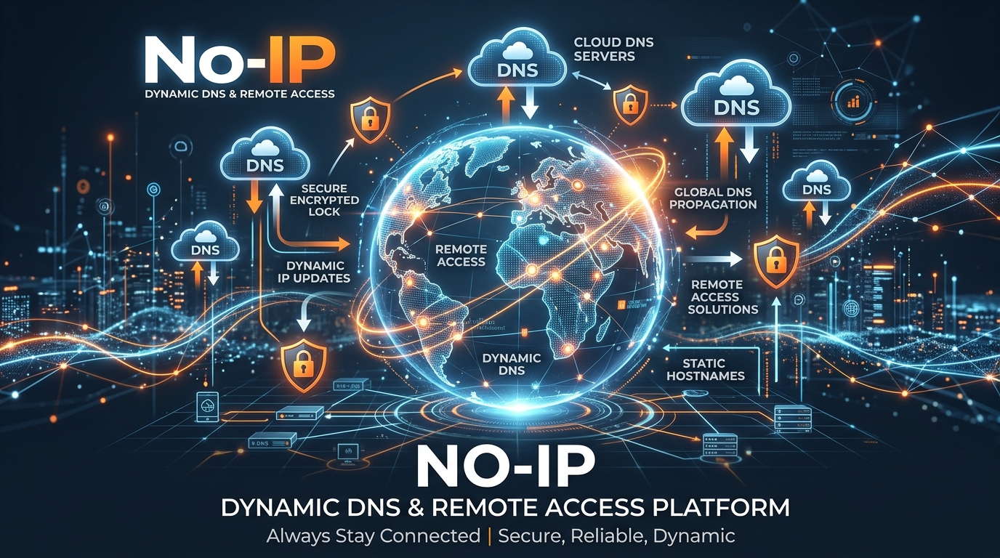
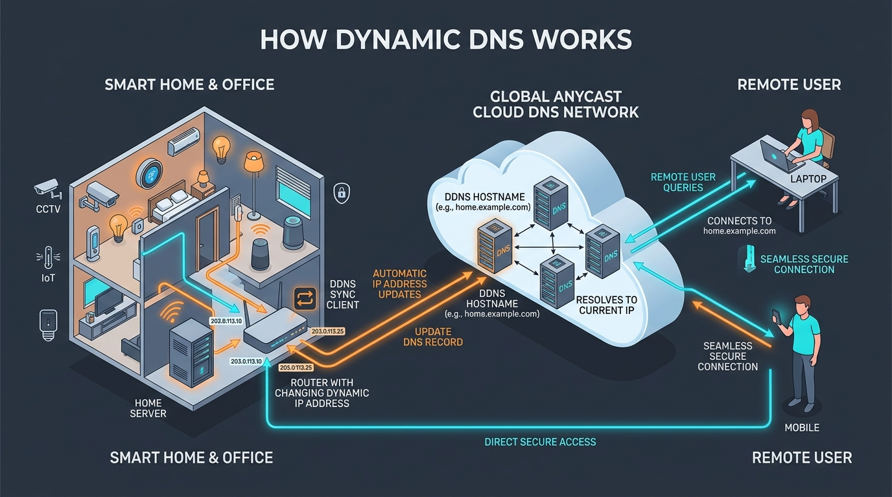
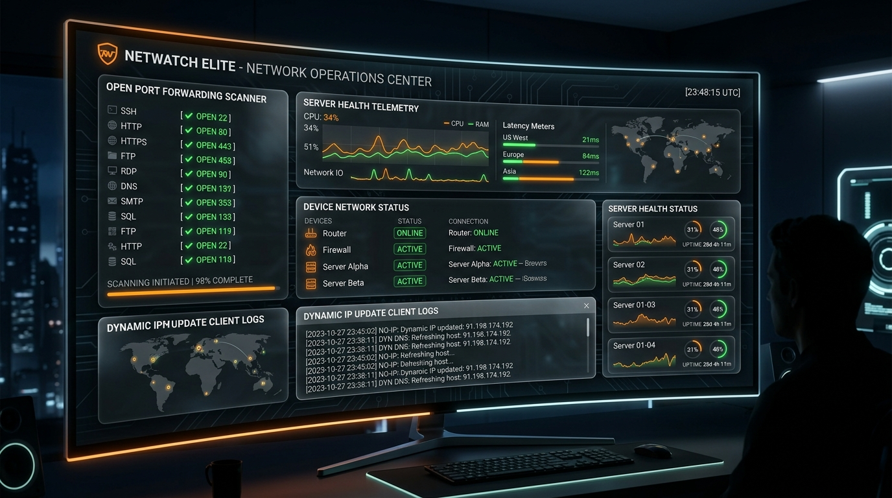

# 🌐 No-IP DNS & Remote Access Web Platform

<p align="center">
  
  <br />
  <strong>No-IP Dynamic DNS & Remote Access App</strong>
  <br />
  <sub>PWA Ready • Browser Favicon & Mobile App Icon Support</sub>
</p>

[](https://react.dev/)
[](https://www.typescriptlang.org/)
[](public/manifest.json)
[](https://vitejs.dev/)
[](https://tailwindcss.com/)
[](LICENSE)

<p align="center">
  
</p>

> **Connect Your Home & Business with Confidence.**
> একটি পূর্ণাঙ্গ, আধুনিক ও ইন্টারঅ্যাক্টিভ ডাইনামিক ডিএনএস (Dynamic DNS) ও রিমোট এক্সেস প্ল্যাটফর্ম।

---

## 📖 সারসংক্ষেপ (Overview)

**No-IP DNS & Remote Access** হলো অফিসিয়াল No-IP প্ল্যাটফর্মের আদলে তৈরি একটি অত্যাধুনিক ওয়েব অ্যাপ্লিকেশন। এর মাধ্যমে ব্যবহারকারীরা সহজে ডাইনামিক আইপিকে স্থায়ী ডোমেইন বা হোস্টনেমে রূপান্তর করতে পারেন, পোর্ট ফরওয়ার্ডিং যাচাই করতে পারেন, DUC (Dynamic Update Client) সিমুলেট করতে পারেন এবং ডেভেলপার API ব্যবহার করে ডিএনএস রেকর্ড স্বয়ংক্রিয়ভাবে আপডেট করতে পারেন।

---

## 🖼️ সিস্টেম আর্কিটেকচার ও ভিজ্যুয়াল প্রিভিউ (Visual Preview & Architecture)

<p align="center">
  
  <br />
  <sub>⚡ <strong>Dynamic DNS ওয়ার্কফ্লো:</strong> হোম রাউটার, আইপি ক্যামেরা ও সার্ভারের পরিবর্তনশীল আইপি স্বয়ংক্রিয়ভাবে গ্লোবাল Anycast DNS এর সাথে সিঙ্ক হয়।</sub>
</p>

<br />

<p align="center">
  
  <br />
  <sub>🛠️ <strong>কানেক্টিভিটি টুলস ড্যাশবোর্ড:</strong> ওপেন পোর্ট স্ক্যানার (Port Forwarding), লাইভ লেটেন্সি টেস্টার এবং DUC ক্লায়েন্ট সিমুলেটর।</sub>
</p>

---

## ✨ প্রধান সুবিধাসমূহ (Key Features)

### 1. 🚀 ইনস্ট্যান্ট ফ্রি হোস্টনেম ক্রিয়েটর (Free DDNS Hostname Creator)
- সেকেন্ডের মধ্যে বিনামূল্যে ডাইনামিক হোস্টনেম তৈরি (যেমন: `myhome.ddns.net`, `camera-feed.zapto.org`)।
- স্বয়ংক্রিয় পাবলিক আইপি ডিটেকশন এবং কাস্টম আইপি ওভাররাইড অপশন।
- তাৎক্ষণিক DNS প্রপাগেশন প্রিভিউ ও ওয়ান-ক্লিক টেস্ট।

### 2. 🎛️ একটিভ ডিএনএস হোস্টনেম ম্যানেজার (Active Hostnames Manager)
- রেজিস্টার করা সমস্ত হোস্টনেমের লাইভ স্ট্যাটাস পর্যবেক্ষণ (Active, Synced, Offline)।
- আইপি অ্যাড্রেস ও FQDN ওয়ান-ক্লিক কপি সুবিধা।
- হোস্টনেম রিফ্রেশ, পোর্ট টেস্টিং এবং নিরাপদ ডিলিট ব্যবস্থা।

### 3. 🔌 লাইভ পোর্ট চেকার টুল (Live Open Port Forwarding Checker)
- রিমোট সার্ভিস ও সার্ভারের পোর্ট খোলা কিনা তা পরীক্ষা করার ইন্টারঅ্যাক্টিভ মডাল।
- প্রি-সেট পোর্ট: HTTP (80), HTTPS (443), RDP (3389), Minecraft (25565), SSH (22), ইত্যাদি।
- কাস্টম পোর্ট টেস্টিং ও বিস্তারিত ট্রাবলশুটিং গাইডলাইন।

### 4. 🔄 ডাইনামিক আপডেট ক্লায়েন্ট (DUC) সিমুলেটর (DUC Client Simulator)
- Windows, Linux ও macOS-এর জন্য No-IP DUC ব্যাকগ্রাউন্ড এজেন্টের ইন্টারঅ্যাক্টিভ সিমুলেশন।
- আইপি পরিবর্তনের সাথে সাথে রিয়েল-টাইম DNS আপডেট ও লগ স্ট্রিমিং।
- স্টার্ট, পজ, ম্যানুয়াল আইপি পরিবর্তন এবং ট্রাফিক সিমুলেশন।

### 5. 🔍 কাস্টম ডোমেইন সার্চ ও কার্ট (Custom Domain Search & Registration)
- `.com`, `.net`, `.org`, `.io`, `.dev` সহ বিভিন্ন TLD সার্চ করার সুবিধা।
- ইনক্লুডেড হু-ইজ (WHOIS) প্রাইভেসি ও ফ্রি SSL সার্টিফিকেট তথ্য।
- কার্ট ও চেকআউট প্রিভিউ সিস্টেম।

### 6. 💻 ডেভেলপার REST API প্লেগ্রাউন্ড (Developer API Integration)
- ডাইনামিক DNS আপডেট প্রোটোকলের রেডিমেড কোড উদাহরণ:
  - cURL
  - Node.js / JavaScript
  - Python
  - Go / Shell Script
- লাইভ API রেসপন্স সিমুলেটর (`good <ip>`, `nochg`, `nohost`, `badauth`)।

### 7. 🌓 ডার্ক ও লাইট মোড (Dark & Light Theme Toggle)
- সুন্দর ডার্ক ও লাইট মোড সাপোর্ট।
- সিস্টেম প্রিফারেন্স স্বয়ংক্রিয়ভাবে শনাক্তকরণ এবং লোকাল স্টোরেজে সংরক্ষণ (`noip_theme`)।
- ডেস্কটপ এবং মোবাইল নেভিগেশনে সহজেই টগল করার ব্যবস্থা।

---

## 🛠️ প্রযুক্তিগত কাঠামো (Tech Stack)

| স্তর | প্রযুক্তি | বিবরণ |
|------|-----------|-------|
| **Frontend Framework** | React 19 + TypeScript | টাইপ-সেফ, মডুলার কম্পোনেন্ট আর্কিটেকচার |
| **Styling** | Tailwind CSS v4 | আধুনিক ইউটিলিটি-ফার্স্ট ও ডার্ক মোড স্টাইলিং |
| **Icons** | Lucide React | লাইটওয়েট ও নিখুঁত ভেক্টর আইকন সেট |
| **Animation** | Motion (`motion/react`) | মসৃণ ট্রানজিশন ও মাইক্রো-ইন্টারঅ্যাকশন |
| **Bundler** | Vite 8.3 | অতি দ্রুত HMR এবং অপ্টিমাইজড প্রোডাকশন বিল্ড |
| **State Management** | React Context & Hooks | থিম ও অ্যাপ্লিকেশন স্টেটের রিয়েল-টাইম ব্যবস্থাপনা |

---

## 📁 প্রজেক্ট ডিরেক্টরি স্ট্রাকচার (Project Structure)

```text
├── public/                     # স্ট্যাটিক অ্যাসেট
├── src/
│   ├── components/             # UI কম্পোনেন্টসমূহ
│   │   ├── ActiveHostnamesManager.tsx # হোস্টনেম ম্যানেজমেন্ট টেবিল
│   │   ├── ApiSimulator.tsx          # REST API সিমুলেশন
│   │   ├── CartModal.tsx             # শপিং কার্ট মডাল
│   │   ├── CustomerUseCases.tsx      # কেস স্টাডি ও ব্যবহারের ক্ষেত্র
│   │   ├── DnsExplainers.tsx         # DDNS বনাম Managed Anycast DNS
│   │   ├── DomainSearchModal.tsx     # ডোমেইন সার্চ ও রেজিস্ট্রেশন
│   │   ├── DucSimulatorModal.tsx     # DUC ক্লায়েন্ট সিমুলেটর
│   │   ├── Footer.tsx                # ফুটার সেকশন
│   │   ├── HeroSection.tsx           # হিরো সেকশন ও হোস্টনেম ফর্ম
│   │   ├── IntegrateViaApiSection.tsx# এপিআই ইন্টিগ্রেশন সেকশন
│   │   ├── Navbar.tsx                # রেসপন্সিভ মেগা মেনু ও থিম টগল
│   │   ├── NoIpLogo.tsx              # ব্র্যান্ড লোগো কম্পোনেন্ট
│   │   ├── PortCheckerModal.tsx      # পোর্ট চেকার টুল মডাল
│   │   ├── PromoBanner.tsx           # টপ প্রমো ব্যানার
│   │   ├── StatsSection.tsx          # নেটওয়ার্ক ও পারফরম্যান্স মেট্রিক
│   │   └── WhyChooseNoIp.tsx         # প্ল্যাটফর্মের সুবিধাসমূহ
│   ├── context/
│   │   └── ThemeContext.tsx          # ডার্ক / লাইট মোড স্টেট প্রোভাইডার
│   ├── types.ts                      # টাইপস্ক্রিপ্ট ইন্টারফেস ও ডেটা মডেল
│   ├── App.tsx                       # প্রধান অ্যাপ্লিকেশন কম্পোনেন্ট
│   ├── main.tsx                      # রুট এন্ট্রি পয়েন্ট
│   └── index.css                     # Tailwind CSS v4 গ্লোবাল স্টাইল
├── index.html                        # HTML এন্ট্রি পয়েন্ট ও মেটা ট্যাগ
├── metadata.json                     # প্ল্যাটফর্ম কনফিগারেশন
├── package.json                      # ডিপেনডেন্সি ও স্ক্রিপ্টসমূহ
├── tsconfig.json                     # টাইপস্ক্রিপ্ট কনফিগারেশন
└── vite.config.ts                    # Vite কনফিগারেশন
```

---

## 🚀 শুরু করার নির্দেশিকা (Getting Started)

### ১. পূর্বশর্ত (Prerequisites)
- **Node.js** (v18 বা তার পরবর্তী সংস্করণ)
- **npm**, **yarn**, বা **bun**

### ২. ইনস্টলেশন (Installation)
রিপোজিটরিটি ক্লোন করুন অথবা প্রজেক্ট ফোল্ডারে টার্মিনাল ওপেন করে ডিপেনডেন্সি ইনস্টল করুন:

```bash
npm install
```

### ৩. ডেভেলপমেন্ট সার্ভার চালু করা (Run Development Server)
লোকাল ডেভেলপমেন্ট সার্ভার চালু করতে:

```bash
npm run dev
```
ব্রাউজারে `http://localhost:3000` ঠিকানায় অ্যাপটি ওপেন হবে।

### ৪. প্রোডাকশন বিল্ড (Production Build)
প্রোডাকশনের জন্য অপ্টিমাইজড বান্ডেল তৈরি করতে:

```bash
npm run build
```

### ৫. কোড লিন্টিং ও টাইপচেক (Code Linting)
```bash
npm run lint
```

---

## 💡 ব্যবহারের গাইড (User Guide)

1. **ফ্রি হোস্টনেম তৈরি**:
   - হোমপেজের হিরো কার্ডে আপনার পছন্দের সাবডোমেইন নাম লিখুন (যেমন: `myhomerouter`)।
   - ড্রপডাউন থেকে ডোমেইন সিলেক্ট করুন (যেমন: `.ddns.net`, `.hopto.org`, `.zapto.org`)।
   - **Create Free Hostname** বাটনে ক্লিক করুন। সাথে সাথে আপনার বর্তমান পাবলিক আইপির সাথে হোস্টনেম লিঙ্ক হয়ে যাবে।

2. **পোর্ট ফরওয়ার্ডিং পরীক্ষা**:
   - নেভিগেশনের **Port Checker Tool** অথবা হোস্টনেমের পাশের অ্যাকশন বাটনে ক্লিক করুন।
   - পোর্ট নম্বর লিখুন (যেমন: ৮০, ৪৪৩, ২৫৫৬৫) এবং **Check Port** বাটনে ক্লিক করে কানেক্টিভিটি টেস্ট করুন।

3. **DUC সিমুলেটর চালানো**:
   - নেভবারের ড্রপডাউন বা ম্যানেজার থেকে **DUC Client Simulator** ওপেন করুন।
   - স্ট্যাটাস দেখুন, আইপি পরিবর্তন পরীক্ষা করুন এবং অটোমেটিক ডিএনএস আপডেটের লাইভ লগ পর্যবেক্ষণ করুন।

4. **থিম পরিবর্তন**:
   - টপবারের ইউটিলিটি মেনু অথবা মোবাইল মেনু থেকে **Dark Mode / Light Mode** বাটনে ক্লিক করে সহজে লুক পরিবর্তন করুন।

---

## 📄 লাইসেন্স (License)

এই প্রজেক্টটি MIT লাইসেন্সের অধীনে উন্মুক্ত। বিস্তারিত জানার জন্য প্রজেক্টের ডকুমেন্টেশন দেখুন।
